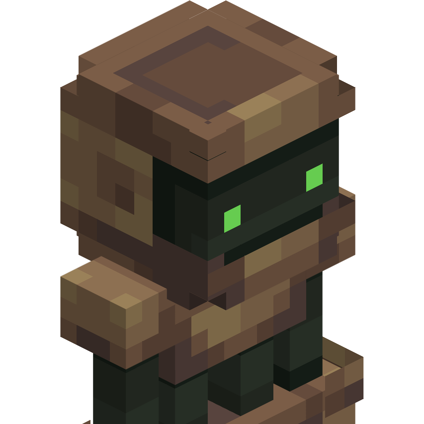

# Cyberbop

Build your custom cyber body and experience the world through a new, better form.

This mod introduces a simple cybernetics system, allowing you to craft and assemble a robotic body from individual parts like heads and legs, plus modules that will give you powers. Once you complete your build, you can seamlessly take control of your new mechanical body and gain new abilities.
#### [Discord Server](https://discord.gg/DcemWeskeZ) | [CurseForge Page](https://curseforge.com/minecraft/mc-mods/cyberbop)

